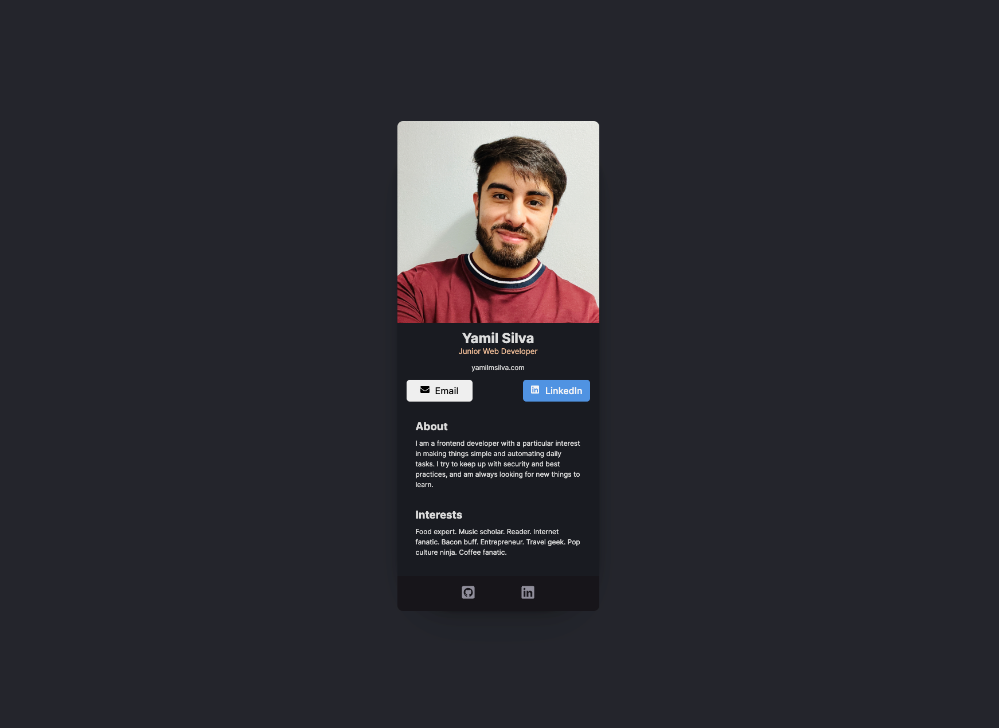

# Digital Business Card

This project was bootstrapped with [Create React App](https://github.com/facebook/create-react-app).

## Available Scripts

In the project directory, you can run:

## Overview
- Requirements
- Build from scratch!
- Fill in your own information
- Separate components for:
    - Header (photo, name, buttons, etc.)
    - Article (About - Interests)
    - Footer (social icons)

### Screenshot

#### Desktop

### Links
If you want to see the final product, in the project directory, you can run:
- [Live 🔗] https://yamilcard.netlify.app/

## My process

### Built with
- Semantic HTML5 markup
- CSS custom properties
- JavaScript
- React.JS
- Flexbox

## Author
- Yamil Silva

## Acknowledgements

- [Scrimba](https://scrimba.com)

